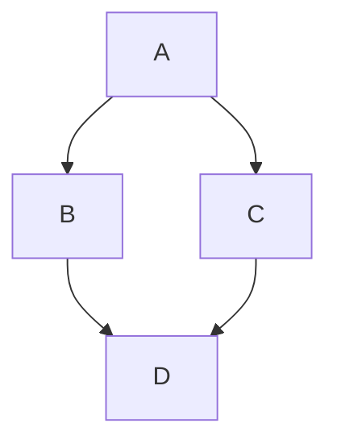
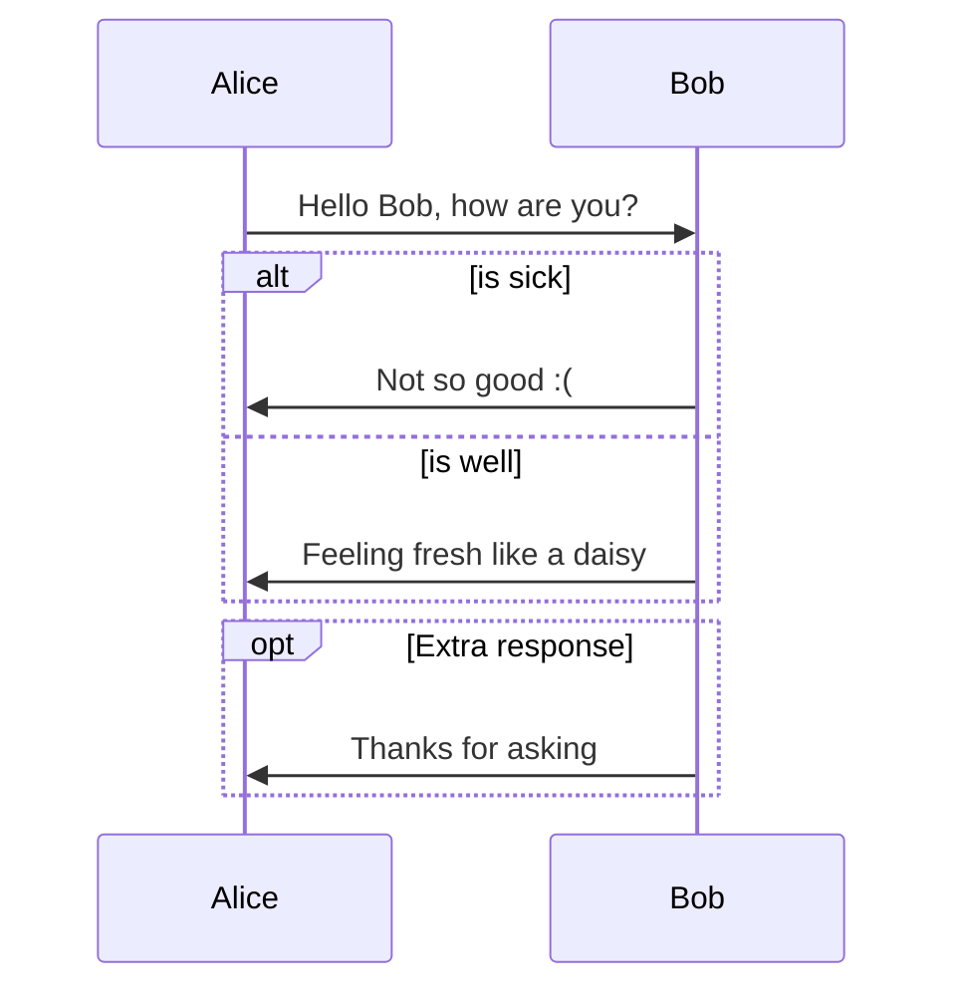
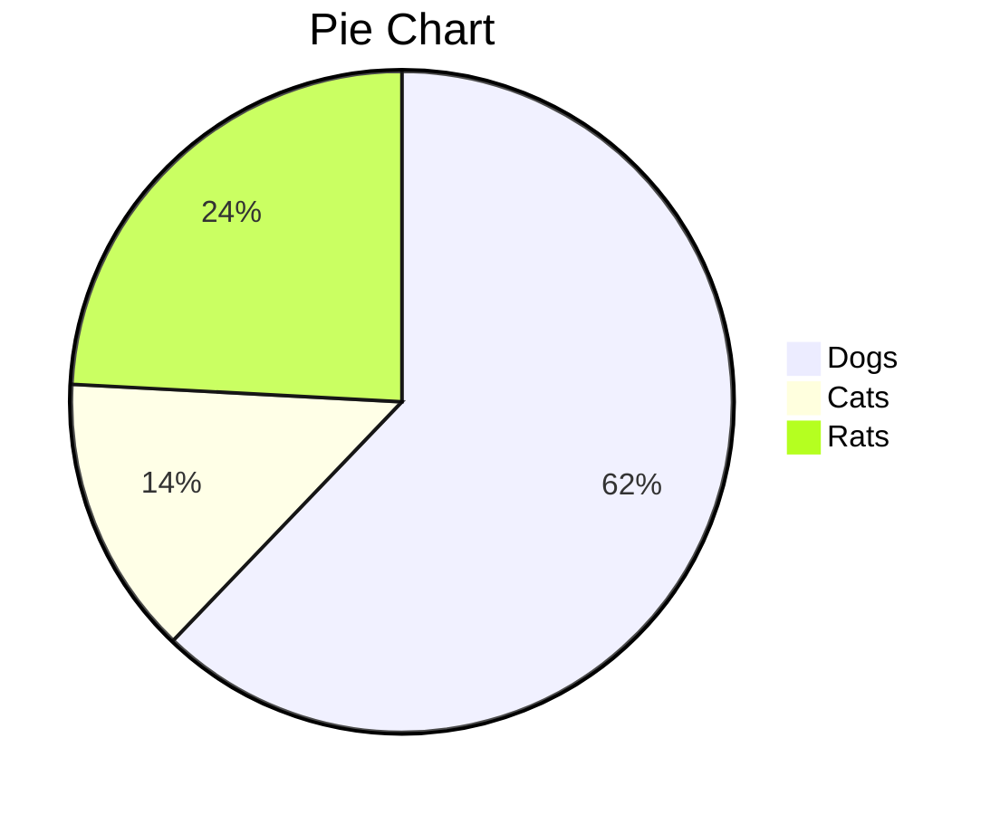
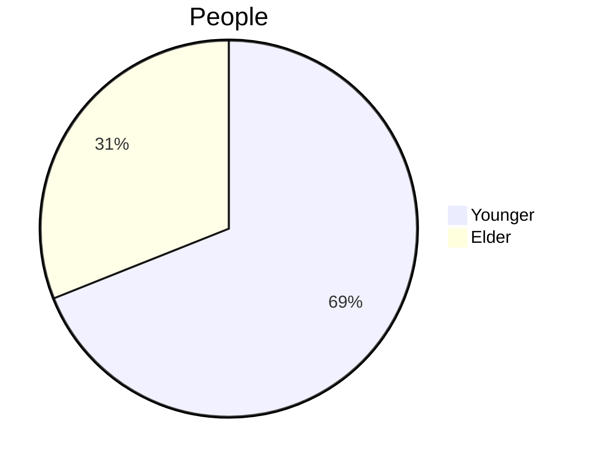

# Как приготовить вкусный чай

В этой инструкции я научу вас готовить perfect cup of tea!

## Что вам понадобится

- Чайник с водой
- Чашка
- Чайный пакетик (чёрный или зелёный)
- Ложка
- По желанию: сахар, лимон, мёд

## Пошаговая инструкция

### 1. Нагрейте воду

Налейте воду в чайник и включите его.

>
> **Внимание!** Не используйте повторно кипячёную воду — она портит вкус чая.
>

### 2. Подготовьте чашку

Пока вода нагревается, положите чайный пакетик в чистую чашку.

### 3. Залейте водой

Когда вода закипит, залейте её в чашку с пакетиком.

**Важные моменты:**

- Для зелёного чая — вода 80°C (подождите 1 минуту после кипения)
- Для чёрного чая — крутой кипяток

### 4. Настаивайте

Оставьте чай настаиваться на 3-5 минут. Не меньше!

### 5. Добавьте дополнения

Достаньте пакетик и добавьте по вкусу:

1. Сахар — 1-2 ложки
2. Лимон — 1 дольку
3. Мёд — 1 ложку


## Частые проблемы

**Чай получился горьким**

- Слишком долго настаивали
- Вода слишком горячая для этого сорта

**Чай слишком слабый**

- Мало настаивали
- Недостаточно горячая вода









```geojson
{    
 "type": "FeatureCollection",    
 "features": [    
   {    
     "type": "Feature",    
     "id": 1,    
     "properties": {    
       "ID": 0    
     },    
     "geometry": {    
       "type": "Polygon",    
       "coordinates": [    
         [    
             [-90,35],    
             [-90,30],    
             [-85,30],    
             [-85,35],    
             [-90,35]    
         ]    
       ]    
     }    
   }    
 ]    
}
```

```stl
solid cube_corner  
facet normal 0.0 -1.0 0.0  
outer loop  
vertex 0.0 0.0 0.0  
vertex 1.0 0.0 0.0  
vertex 0.0 0.0 1.0  
endloop  
endfacet  
facet normal 0.0 0.0 -1.0  
outer loop  
vertex 0.0 0.0 0.0  
vertex 0.0 1.0 0.0  
vertex 1.0 0.0 0.0  
endloop  
endfacet  
facet normal -1.0 0.0 0.0  
outer loop  
vertex 0.0 0.0 0.0  
vertex 0.0 0.0 1.0  
vertex 0.0 1.0 0.0  
endloop  
endfacet  
facet normal 0.577 0.577 0.577  
outer loop  
vertex 1.0 0.0 0.0  
vertex 0.0 1.0 0.0  
vertex 0.0 0.0 1.0  
endloop  
endfacet  
endsolid
```

 
